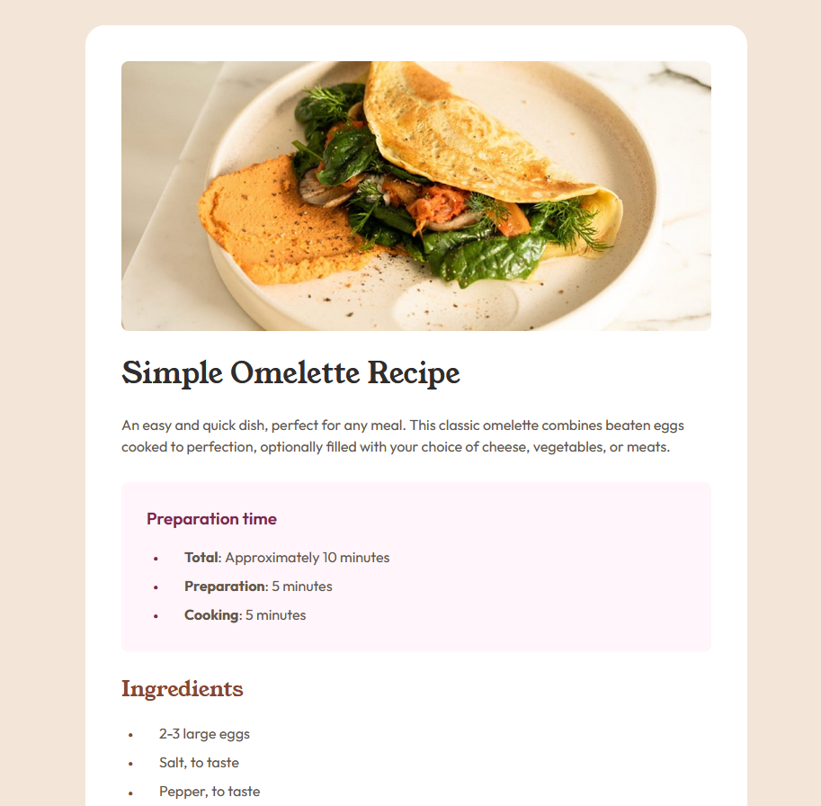

# Frontend Mentor - Recipe page solution

This is a solution to the [Recipe page challenge on Frontend Mentor](https://www.frontendmentor.io/challenges/recipe-page-KiTsR8QQKm). Frontend Mentor challenges help you improve your coding skills by building realistic projects. 

## Overview

### Screenshot

### Links

- Live Site URL: [Recipe Page](https://dcco.github.io/jlbc-front-recipe/)

## Summary

### Built with

- Standard HTML, CSS

### Takeaways

This project was the first in a series of challenges I'm undertaking to improve my front-end and overall web development skills. In this project, I built a very simple recipe web page to get accustomed to building a web page based on a mockup, and general web development workflow.

For this project, I used the most basic HTML and CSS so I could get feedback on the fundamental aspects of my HTML/CSS structuring. As I complete more projects, I hope to learn more modern technologies/frameworks one-by-one.
